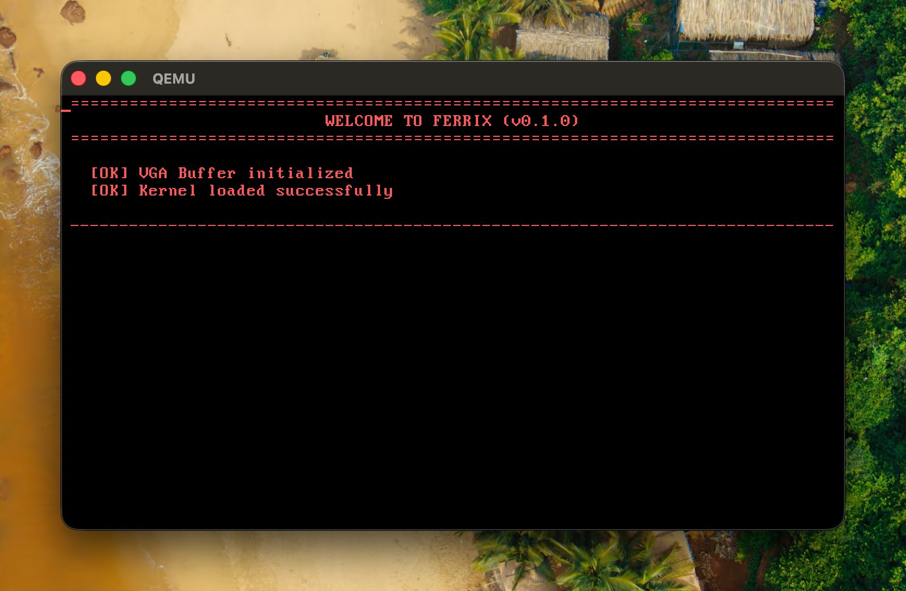
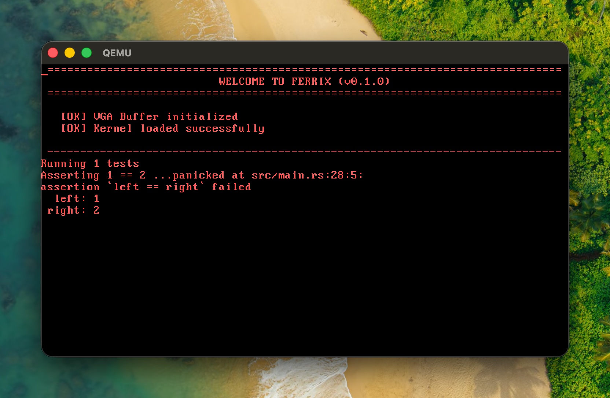
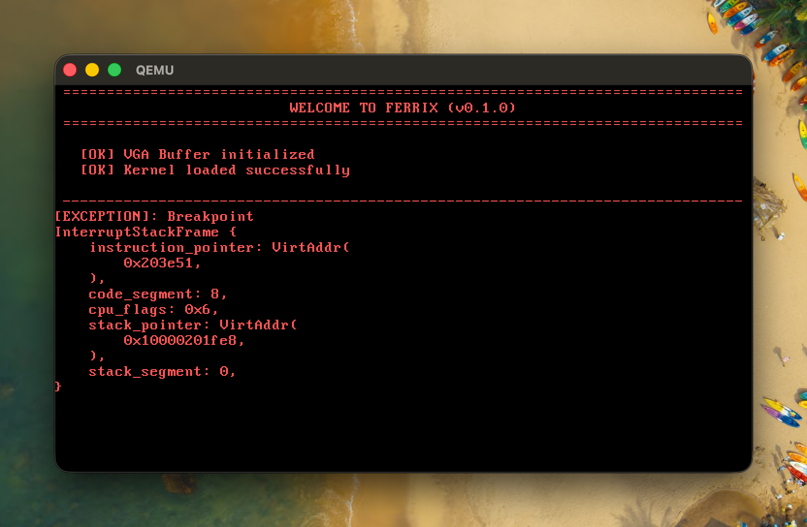
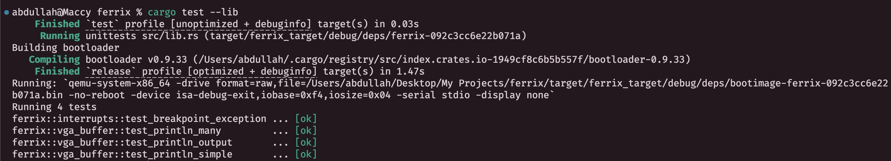

# Ferrix: An x86-64 OS written in Rust

Inspired by: [Blog OS](https://os.phil-opp.com) by Philipp Oppermann.

---
## Devlog

### VGA Buffer Implementation
- Implemented a VGA text buffer driver that writes directly to memory address `0xb8000` to display colored text on screen. 
- The `print!` and `println!` macros were overridden to use the custom VGA writer via the [`core::fmt::Write`](https://doc.rust-lang.org/core/fmt/trait.Write.html) trait, enabling formatted text output directly to the screen.

 

### Custom Testing Framework
- Built a custom testing harness using Rust's `custom_test_frameworks` feature, as we're on bare metal.
- Tests communicate results through a serial port interface and automatically exit QEMU with success/failure codes.

 

### IDT and Basic CPU Exceptions Setup
- Used the `x86_64` crate to initialise an Interrupt Descriptor Table.
- Added a breakpoint exception handler (triggered by `int3`).

- Added padding and color in test outputs (via `cargo test`).

 

### Double / Triple Fault Handling
- Initialised a GDT (Global Descriptor Table) and its TSS (Task Segment Selector) entry.
- Configured the first IST as the **Double Fault Exception Stack**, a dedicated, known-good stack the CPU switches to in the case of double faults, preventing triple faults.
- Tested with a stack-overflow situation (in `tests/stack_overflow.rs`).

 

### Interrupts and Keyboard Setup

- Added hardware interrupt support with PIC initialization and handlers for timer and keyboard interrupts.
- Implemented keyboard input decoding and printing using the `pc_keyboard` crate.

---

