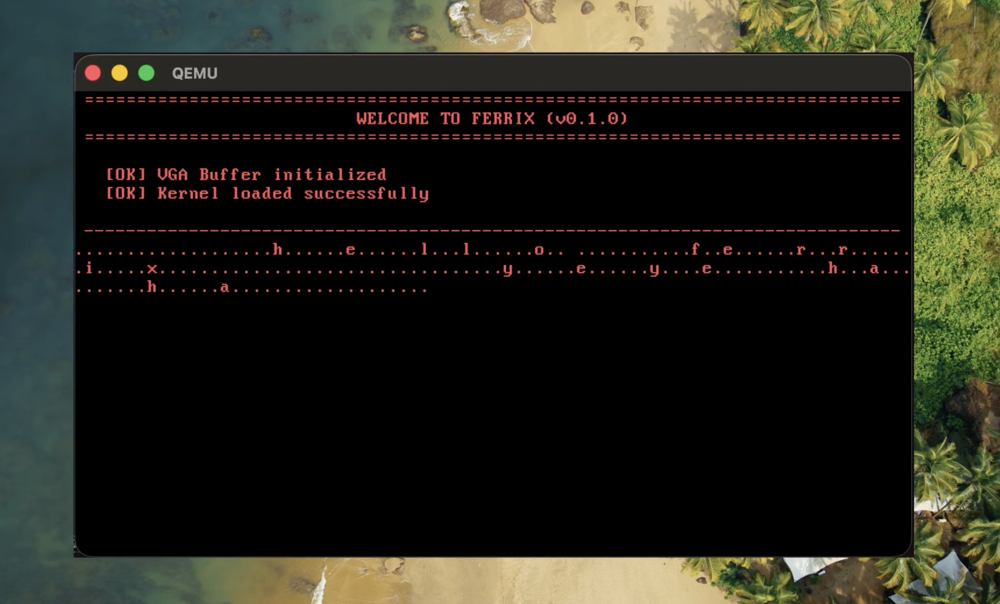
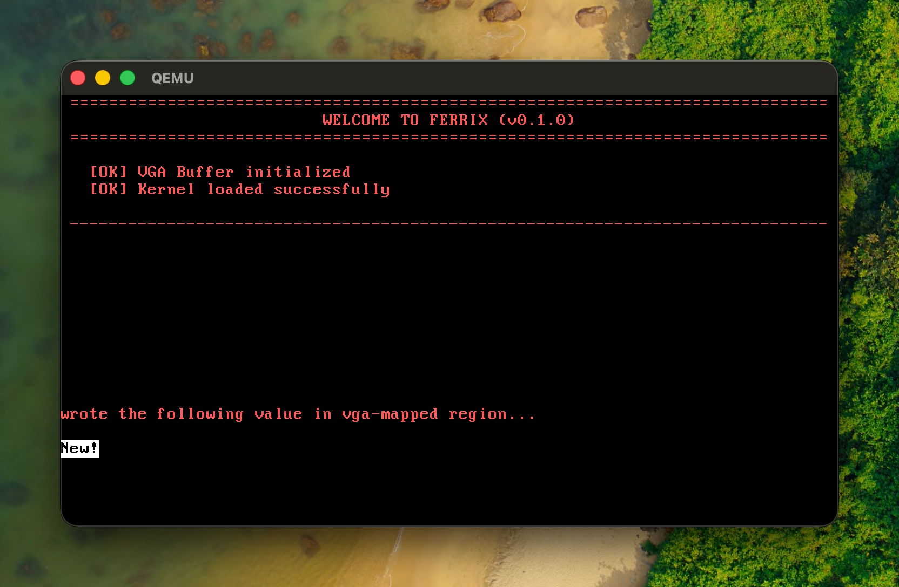
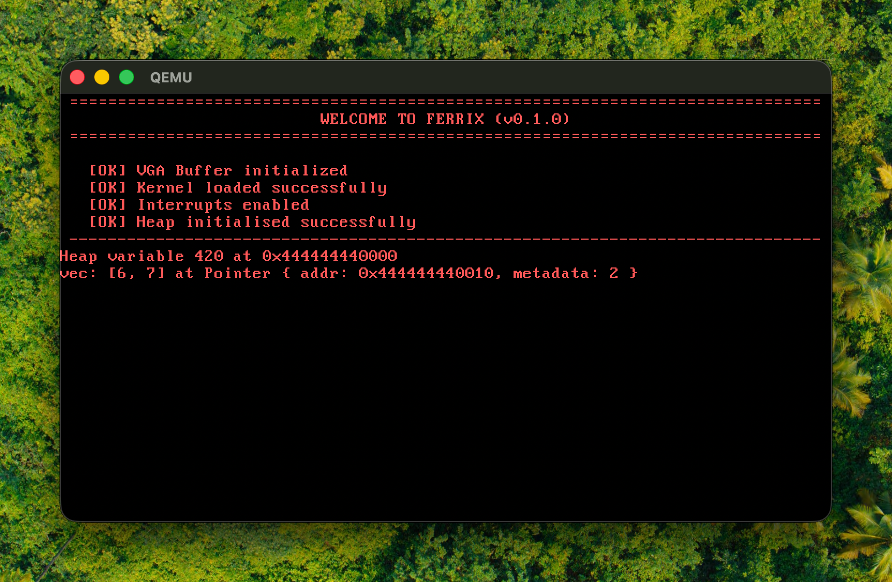

# Ferrix: An x86-64 OS written in Rust

This is a code-along project intended for understanding Rust fundamentals, by implementing basic OS components and using existing Rust crates to make a bare-bones x86-64 operating system.

*Inspired by: [Blog OS](https://os.phil-opp.com) by Philipp Oppermann.*

---

## Setup

### Prerequisites

**1. C compiler**
- **Linux**: `apt install build-essential` (Debian/Ubuntu)
- **macOS**: `xcode-select --install`
- **Windows**: Install [Visual Studio Build Tools](https://visualstudio.microsoft.com/downloads/#build-tools-for-visual-studio-2022)

**2. Rust**  
Install via [rustup](https://rustup.rs/), if you do not already have the Rust compiler:
```bash
curl --proto '=https' --tlsv1.2 -sSf https://sh.rustup.rs | sh -s -- -y && source $HOME/.cargo/env
```

**3. QEMU**
- **macOS**: `brew install qemu`
- **Linux**: `apt install qemu-system-x86` (Debian/Ubuntu) or equivalent
- **Windows**: Download from [qemu.org](https://www.qemu.org/download/)

### Running the Kernel

**1. Switch to Rust nightly**
```bash
rustup default nightly
```

**2. Install required components**
```bash
rustup component add rust-src llvm-tools-preview
```

**3. Clone the repository**
```bash
git clone https://github.com/VohraAK/Ferrix
cd Ferrix
```

**4. Install bootimage tool**
```bash
cargo install bootimage
```

**5. Build**
```bash
cargo build
```

**6. Run in QEMU**
```bash
cargo run
```

**7. Run tests**
```bash
cargo test
```


---
## Devlog

### VGA Buffer Implementation
- Implemented a VGA text buffer driver that writes directly to memory address `0xb8000` to display colored text on screen. 
- The `print!` and `println!` macros were overridden to use the custom VGA writer via the [`core::fmt::Write`](https://doc.rust-lang.org/core/fmt/trait.Write.html) trait, enabling formatted text output directly to the screen.


<br>

### Custom Testing Framework
- Built a custom testing harness using Rust's `custom_test_frameworks` feature, as we're on bare metal.
- Tests communicate results through a serial port interface and automatically exit QEMU with success/failure codes.


<br>

### IDT and Basic CPU Exceptions Setup
- Used the `x86_64` crate to initialise an Interrupt Descriptor Table.
- Added a breakpoint exception handler (triggered by `int3`).


- Added padding and color in test outputs (via `cargo test`).


<br>

### Double / Triple Fault Handling
- Initialised a GDT (Global Descriptor Table) and its TSS (Task Segment Selector) entry.
- Configured the first IST as the **Double Fault Exception Stack**, a dedicated, known-good stack the CPU switches to in the case of double faults, preventing triple faults.
- Tested with a stack-overflow situation (in `tests/stack_overflow.rs`).

<br>

### Interrupts and Keyboard Setup

- Added hardware interrupt support with PIC initialization and handlers for timer and keyboard interrupts.
- Set up the initial timer interrupt to enable periodic system ticks *(each "." represents a timer interrupt).*
- Implemented reading and printing of raw scancodes from the PS/2 keyboard data port.
- Added scancode decoding using the `pc-keyboard` crate to convert raw keyboard input into readable characters.




<br>


### Implemented Paging (Complete Physical Address Space)
- Used the `bootloader` crate to get the memory map of the system.
- Created a `BootInfoFrameAllocator` struct and implemented the provided `FrameAllocator` trait to map a frame to the VGA frame buffer @`0xb8000`.
- Used the `OffsetPageTable` abstraction to manage paging and map all usable physical memory regions safely.



<br>

#### Heap Initialisation with `linked_list_allocator`
- Created a heap initialiser which maps all physical frames in a specified virtual address heap region, using `Mapper` and `FrameAllocator<Size4KiB>` instances.
- Added the `linked_list_allocator` crate as a dependency, and set it as the global allocator.



<br>

---